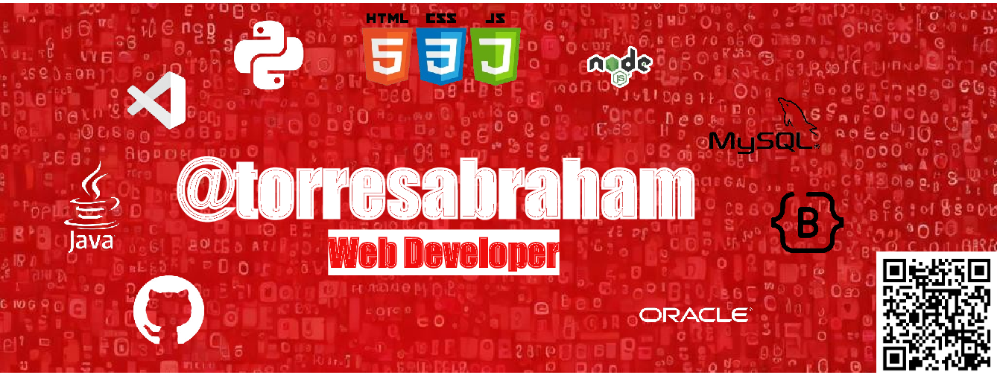

<h1 align="center"><b>Hi, I'm <a href="https://torresabraham.github.io">Abraham de Torres </a></b>👋
  

	
## <picture></picture> **About me**

- A passionate front-end developer
- Lover of nature and sports in free time.
- Currently studying Web Application Development (DAW)
- Personal website [link](https://torresabraham.github.io)
- Open to an internship or a new job opportunity, this is [my cv](./media/Currículum%20Abraham%20Informática-2024.pdf)

 

## <b> Skills</b>

- **Languages**:
  
    
    
    

    
- **Front-End Development**:

   
   
   
   

- **Cloud Hosting**:

    

- **Softwares and Tools**:

    
    
    
     

- **Databases**:

    
       

 

## <b> Let's Connect..!</b>
 

<ul>

<li>

</li>

 

<li>

</li>

 

<li>

</li>
	
</ul>

 

 
 
 

